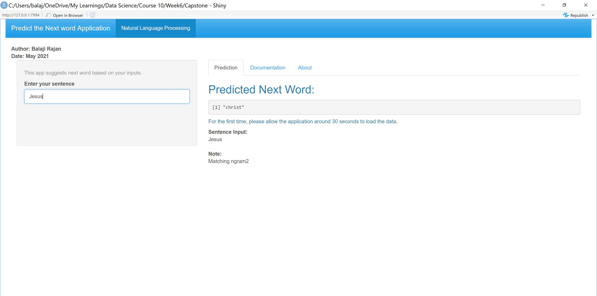

Predict Next word
========================================================
author: Balaji Rajan
date: 19-May-2021
autosize: true

Predict Next Word
========================================================

How predictive models work
<small>
- Studies have shown a representation of 350,000 words and 150 documents are adequate words for American English
- We build a word repository by reading from blogs, tweets and news to build this repository
- We then take 4 words at a time that occur in a pattern and map their frequency of occuring together. This is 4-gram
- We do this for 3-gram, 2-gram and 1-gram. Each time noting the frequency of them occuring together 
</small>

Prediction
<small>
- When we give a string of words, we match the 3 important words (removing articles, numbers, profanities etc.) to first 3 words of 4-gram. If there is a match, prediction is the 4th word of 4-gram.
- If there is no match, we go to 3-gram, 2-gram and ultimately 1-gram to make prediction
</small>

Performance of the Algorithm
========================================================
<small> n-grams have been in study of languages for a very long time. 
However, the datastructures and the memory requirement posed a huge challenge in creating the ability to predict really well. 

If all the knowledge of humanity were to be constructed into n-grams, we will have a nearly accurate view of the prediction. 

World, unfortunately limits our ability in terms of RAM capability and the free shiny app hosting capability...:) </small>

Compromise
<small>
1. We choose to limit the number of documents read to 150 and number of words to 350000 in creation of our grams

2. We stop with matching last 3 words from user and comparing it with 4 grams for a match, then 3 gram for a match, then 2 gram and one gram; in that order
</small>

Product working
========================================================

<small>The user is prompted to type the word, and the prediction is made on the right side of the screen. 
In addition, the user can see the documentation and the About section where the detais of working are given. </small>

Some important aspects
========================================================

We have used quantend package. This was the best in terms of performance and data manipulation. Before settling on this package, I had tried Weka, and standard structures. 

Quanteda stood out because of excellent datastructure management and ability to give data.tables for manipulations. 

THANK YOU
========================================================

Repositories:

Shiny app: https://balajir2.shinyapps.io/Capstone/

Git hub: 

https://github.com/balajir2/Datasciences-Capstone-Project/blob/main/server.R https://github.com/balajir2/Datasciences-Capstone-Project/blob/main/ui.R
https://github.com/balajir2/Datasciences-Capstone-Project/blob/main/NLP.R

Author: 

BALAJI RAJAN May 2021
